# 습작4 — 아트 기획서

**처음 합류하는 분에게 주는 문서다.** 세 부로 나눠 놓았고, **1부만 읽어도 게임이 무슨
이야기인지는 안다.**

```
1부  스토리     플레이어가 실제로 만나는 순서 그대로
2부  세계관     플레이어에게는 끝까지 대놓고 말해 주지 않는 것들. 만드는 사람은 알아야 한다
3부  플레이     화면이 어떻게 생겼고 어떻게 돌아가는가 (사진)
부록  그리는 규칙  화풍 · 규격 · 그려야 할 것
```

화면 사진은 전부 **지금 돌아가는 빌드를 실제로 띄워서 찍은 것**이다(`tools/_shots.gd`).
콘셉트 이미지가 아니라 현재 상태다.

| 더 깊이 볼 때 | |
|---|---|
| `스토리라인.md` | 이야기 전체. **1·2부의 원본이고 훨씬 자세하다** |
| `첫꿈.md` · `둘째꿈.md` · `셋째꿈.md` | 각 꿈의 세부와 만드는 법 |
| `스토리자료.md` | 세계의 규칙을 조목조목 |
| `전투.md` | 등불이 마나가 된 규칙, 비용표 |

> **표시 규칙** — ***(미정)*** 이라고 적힌 것은 아직 확정이 아니라 논의하자고 올려 둔
> 것이다. 표시가 없으면 이미 정해진 것이다.

---
---

# 1부 — 스토리

**플레이어가 만나는 순서 그대로 쓴다.** 이 게임은 설명을 먼저 주지 않는다 — 걷다가
읽다가 마주치면서 조금씩 알게 되는 구조라, 그 순서대로 읽어야 무슨 감각인지 안다.

## 시작 — 검은 화면

경구 한 줄이 뜬다.

> *세계를 건너다니는 자에게는 그곳이 온전히 보이지 않는다.*
> *등불이 비추는 것만 실재한다.*

그리고 **등불이 켜진다.** 켜진 만큼만 세상이 보인다 — 발밑의 모래, 저 앞의 돌기둥.
플레이어가 이 게임에서 처음 배우는 것은 이야기가 아니라 **이 감각**이다.

빛이 넓어지면 앞에 **관문**이 서 있다. 룬이 새겨진 거대한 돌문이고, 문 너머가 굼실거린다.
걸어 들어간다.

## 서고 — 아무도 없다

관문 너머는 **심연 위에 놓인 십자 통로**다. 아카식 레코드처럼 모든 것이 기록되어 있고,
바닥에는 낱장들이 흩날린다. 벽이 없다 — 바닥이 끝나면 그냥 끝난다.

**여기가 거점인데 아무도 없다.** 플레이어는 이것을 "아직 안 만든 것"으로 읽을 수도 있다.
**아니다. 다 죽었기 때문이다.** 이 사실은 한참 뒤에야 알게 된다.

바닥에 널린 종이 더미 중 **몇이 일어선다.** 어느 것이 살아 있는지 알 수 없게 가짜와
진짜를 같은 그림으로 섞어 놓았다.

## 서가 넷 — 여기서 처음 알게 된다

열람실에 **읽을 수 있는 서가**가 넷 있다. 넷을 다 읽어야 북쪽 길이 열린다.

글은 **우리가 모르는 문자로 적혀 있다.** 한 자씩 써지고, 그다음 등불빛이 글줄을 훑고
지나가면서 한글로 풀린다. **읽는 것 자체가 이 게임의 규칙을 보여주는 장면**이다 —
빛이 지나간 자리가 읽힌다.

여기서 플레이어가 알게 되는 것은 조각들이다. 세상이 꿈이라는 것, "그것"이라 부르는
무언가가 세상마다 있다는 것, 그리고 —

> *이름을 정하려고 모인 것이 네 번이다. 네 번 다 못 정했다.*

**모인 사람들이 있었다는 것.** 지금은 없다.

## 그것 — 이길 수 없는 것과 처음 마주선다

북쪽 끝에 **서고의 그것**이 있다. 눈으로 뒤덮인 고리 셋에 가운데 큰 눈 하나.
아무 말도 안 하고 덤비지도 않고 그냥 계속 쳐다본다.

하는 일은 하나 — **들어오는 이방인을 막고 결사대만 통과시킨다.**
**적이 아니라 관문이다.** 대화로 끝내든 전투로 끝내든, 치르고 나면 열어 준다.

이 자리에서 플레이어는 이 게임의 규칙 하나를 배운다.

```
사람과의 싸움     이길 수 있다
그것과의 마주섬   못 이긴다
```

## 계단의 방 — 꿈을 고른다 *(아직 안 만들었다)*

포탈 너머의 중간 거점. 구슬이 놓여 있고 **구슬 하나가 갈 수 있는 꿈 하나**다.
순서는 자유롭다.

---

## 첫째 꿈 — 걷는 것

> **원인이 없는 이상.** 고칠 것을 찾으러 갔는데 고칠 것이 없다.

**도착한다.** 엄청 뜨겁고 밝다. 땅이 전부 평평해서 그늘이 하나도 없다.
지평선에 **엄청나게 큰 무언가**가 보인다. 그것이 이 세계를 돌면서 걷고 있고,
**그것이 지나갈 때가 밤이고 지나가고 나면 낮이다.** 그게 이 세계의 이치다.

여기서 등불의 규칙이 뒤집힌다 — **너무 밝아도 안 보인다.** 등불은 빛을 내는 물건이
아니라 빛을 빨아들여 보여주는 물건이라, 눈부신 곳에서도 기름을 태워야 한다.

**그늘로 들어간다.** 그것이 드리우는 그림자가 이 세계의 유일한 밤이고, 유일하게
등불이 안 드는 곳이다. 사람들은 둘로 갈려 있다 — 그늘을 따라 걷는 **행렬**과,
따라가기를 그만두고 한자리에 남은 **마을**.

**마을에서 조사한다.** 이상이 생겼다는 것만 알고 왔지 뭐가 문제인지는 모른다.
알아보다 보면 이상한 것이 걸린다 — **사람들이 조금씩 세상을 의심하기 시작했다.**

**노인을 만난다.** 의문의 최초다. 이미 확신하고 있다. 마을 사람들은 그를 노망이라
여기지만 **사실이 아니다.**

여기가 이 꿈의 심장이다. **순서가 거꾸로다** — 노인이 의심해서 세상이 흔들린 것이
아니라, **세상이 흔들려서 노인이 생겼다.** 그는 원인이 아니라 **불안정이 사람 모양으로
나온 것**이다. 그리고 그 의문이 **그것에게 옮겨갔다.** 안 늙는 존재가 늙기 시작했다.

**노인이 괴물이 된다.** 깨달은 사람은 미치거나 꿈에 잡아먹힌다. 싸운다.
**그런데 노인을 어떻게 하든 안 낫는다.** 이미 옮겨갔고, 마을에도 남아 있다.

**그것에게 간다.** 조사의 결론이 그것으로 향한다 — 발치까지 가야 한다.
지평선의 그 크기가 걸어갈수록 커진다.

**마주선다.** 그리고 **그것이 묻는다.**

> **"이것이 꿈인가? 아닌가?"**

```
진실을 말한다   →   영원히 멈추고 쉰다
거짓을 말한다   →   다시 움직인다
```

**최종전이 질문 하나에 대답하는 것이다.** 때려잡는 것이 아니다.
그리고 **어느 쪽도 깨끗하지 않다.** 멈추면 낮과 밤이 끝나 그늘이 영영 사라지는데,
그것 쪽에서 보면 끝없이 걸어온 것이 처음으로 **쉬는** 것이다.
게다가 거짓을 말하는 것이 **결사가 시키는 일**이라, 진실을 말하는 것은 결사를 등지는
일이 된다.

**서고로 돌아와 적는다.** 서가가 하나 는다.

**남는 감각 — 몰랐다.**

---

## 둘째 꿈 — 나가려는 것

> **사람이 만들고 있는 이상.** 고칠 것은 뚜렷한데 **그 사람 말이 맞는다.**

**사막에 내린다.** 저 멀리 검은 것이 기어간다. **거대한 지상전함**이고, 이 세계
사람들은 전부 그 배에 타고 산다. 배가 곧 그들이 사는 곳이고 밖은 사막뿐이다.

**배에 오른다.** 검고 차갑고 좁다. 이 꿈은 거의 전부 배 안에서 벌어진다.
말이 통하는 사람은 **박사** 하나다.

**일을 한다.** 배를 고치고, 튀어나오는 괴물을 잡는다. **처음에는 풍습인 척한다** —
배가 원래부터 있던 것처럼, 목숨을 바치는 것이 이 세계의 풍습인 것처럼.
주인공은 그렇게 **공범이 된다.**

진실은 이렇다. **사람의 이성을 태워 나온 에너지가 이 배의 연료**다. 수천 수만의
목숨값으로 전진하고 있고, **다 못 녹은 껍데기가 괴물이 된다.** 주인공이 잡고 다닌
것이 그것이다.

**조타실에 둘만 남는다.** *"곧, 목적지입니다."*

여기서 **플레이어가 말을 걸어야 이야기가 움직인다.** 추궁하면 박사는 숨기지 않는다.
그는 **여기가 꿈이라는 것을 알고** 세계의 끝에 닿으려 한다. 그리고 주인공이
**외부의 존재**라는 것을 진작 알고 있었고, **자신과 같은 것을 꿈꾸는 줄 알고 있었다.**

동의할지 막을지 고른다. **그런데 어느 쪽을 골라도 결말이 안 바뀐다** — 막으면 전투가
하나 붙을 뿐이다.

**가장자리에 거의 닿는다.** 마지막으로 필요한 연료가 **박사 자신**이었고,
**본인도 처음부터 알고 있었다.** 스스로 앉아서 녹는다.

**최종전 — 괴물이 된 박사.** 그동안 사람으로 버틴 것은 의지가 너무 강해 정신을 붙잡고
있었던 것이라, 싸우는 동안 모습이 점점 기괴하게 변해 간다.

> *"제가 수만을 죽인 학살자라고 사람들이 부르는데, 선생, 저는 그 말이 이해가 되지 않습니다."*

**밖으로 나가 그것을 막으러 간다. 못 막는다.** 배는 세상의 끝으로 가고 **세상이 무너진다.**
주인공은 서고로 밀려난다.

**이 꿈은 실패로 끝난다.** 남는 것은 적어 둔 기록뿐이다.

**남는 감각 — 도왔다.**

---

## 셋째 꿈 — 올라가는 것

> **막을 수 있는 이상.** 다만 막는 값이 친구다.

**계곡으로 들어온다.** 들어오는 길이 **왕의 계곡**이고, 거대한 것들 아래를 걸어서
지나간다. 저것들이 전부 옛 왕이다.

**나라에 닿는다.** 평범한 판타지 나라다. 성이 있고 마을이 있고 사람이 붐빈다.
그리고 온통 **승천식** 준비로 들떠 있다. 왕은 계곡에서 승천식을 치러 엄청나게
거대해지고 강대한 힘을 얻어 나라를 지킨다 — 계곡에 선 옛 왕들이 전부 그렇게 된 것이다.

**왕자를 만난다. 어린아이다.** 역사상 가장 뛰어난 왕자인데, **전대 왕이 살해당해**
차례가 앞당겨졌다. 얼마 후 승천식이다.

**아무도 그를 아이로 보지 않는다.** 전부 왕으로 본다. **주인공만 아이로 대한다.**
그 아이는 평생 친구가 없었고, 순례자와 자연스럽게 친구가 된다.

**함께 지낸다.** 승천식까지 함께한다. **이 게임에서 유일하게 따뜻한 구간이 여기다.**

그러는 동안 원래 온 목적을 조사한다 — **계곡의 옛 왕들이 요즘 이상하다.**

**전날 밤, 아이가 처음으로 무섭다고 말한다.**

**승천식이 거행된다. 그리고 균열이 온다.** 의식이 실패하고, 아이는 이성을 잃고
**거대한 괴물이 되어 나라를 부순다.**

**막는다.** 죽이는 것이 아니라 **끊긴 의식을 마저 끝내서** 막는다. 이기는 싸움이 아니라
버티는 싸움이다.

아이는 계곡의 빈자리에 서고, **다시는 말을 하지 않는다.**

**남는 감각 — 사랑했다.**

---

## 그리고 아직 안 온 것 — 배신자 ***(미정)***

세 꿈은 지금 **따로 논다.** 서고의 기록만이 그것들을 잇는다.

플레이어가 아직 만나지 않은 사람이 하나 있다. **결사가 원인이라는 것을 먼저 깨닫고,
결사를 줄이려고 단원들을 하나씩 죽여 온 사람**이다. 주인공은 남은 마지막 하나고,
**본인은 모른다.** 서고가 텅 빈 이유가 그것이다.

**언제 어떻게 만나는지가 아직 안 정해졌다.** 그 자리가 정해지면 셋이 한 이야기로 묶인다.

그리고 플레이어는 이미 두 번 미리 대답한 셈이 된다 — 첫째 꿈의 진실/거짓, 둘째 꿈의
동의/막기.

---
---

# 2부 — 세계관

**여기부터는 플레이어에게 대놓고 말해 주지 않는 것들이다.** 조각으로 흘리기만 하고
끝까지 정리해 주지 않는다. 다만 **만드는 사람은 알고 있어야** 그림과 대사가 안 어긋난다.

## 세상 하나가 꿈 하나다

초월적인 존재가 꾸고 있고, 그 안에 사람이 살고 도시가 있고 역사가 있다.
꿈이 깨면 그 세상은 지워진다. **지워지는 것은 아무도 못 막는다.**

## "이상"은 그 존재가 깨어나려는 조짐이다

병이 아니라 **뒤척임**이다. 그리고 **깨어남은 사건이 아니라 과정이다** — 존재가
깨어나 가면서 꿈들이 하나씩 사라지고, **가장 불완전한 꿈부터** 간다.

**그래서 이야기 전체가 시계다.** 하나씩 죽어 가고 있고, 순서가 정해져 있고,
결사는 그 순서를 늦추러 다닌다.

**지금은 거의 모든 세상에 이상이 생겨가는 시절이다.** 초월적 존재 자체가 불안정한가
보다 — 결사도 확신하지는 못한다.

이치에서 벗어날수록 꿈이 불안정해지므로, 결사가 하는 일은 **그 세계의 이치를 제자리로
돌리는 것**이고 방법은 셋이다.

```
이치를 바로잡는다  ·  누군가를 살린다  ·  누군가를 죽인다
```

꿈 셋에 대입하면 **"살린다"가 비어 있고, 그 자리가 넷째 꿈으로 보인다.** *(미정)*

## 균열이 나면 사람이 깨닫는다

이상이 생기면 세상에 **균열**이 생기고, 그 세계 사람 중 누군가는 **여기가 꿈이라는 것을
깨닫는다.** 그리고 괴물이 된다 — 꿈에 잡아먹히거나, 미치거나.

**이치 밖으로 나간 것은 무엇이든 괴물이 될 수 있다.** 사람만이 아니다.

```
사람이 깨닫는다         → 이치 밖으로 → 괴물
그것의 조각이 떨어진다   → 이치 밖으로 → 괴물
이성이 녹다 만다        → 이치 밖으로 → 괴물
```

> **이 세계의 공포 — 알아차리는 것이 곧 파멸이다.**

결사가 급한 진짜 이유도 여기 있다. 이상 자체보다 **균열이 사람을 깨닫게 하는 것**이
더 급하다.

## "그것"

**세상마다 있는 크고 중요한 것을 전부 "그것"이라고 부른다.** 이름이 아니라 부르는
방식이다. 결사는 이름을 안 붙인다.

## ★ 감춰진 층 — 결사가 원인이다

```
다른 세상에서 무언가가 흘러 들어오거나 자주 섞이면 세상이 더 불안정해진다.
그 흘러들어오는 존재가 바로 결사단이다.
```

**소방수가 곧 방화범이다.** 이 한 겹이 이야기 전체를 떠받친다.

| | |
|---|---|
| **주인공은 왜 안 미치나** | 그 세계 사람이 아니라 **그 세계의 이치에 안 묶인다.** 깨달아도 멀쩡하다 |
| **대신 무슨 일이 벌어지나** | **안 미치는 대신, 있는 것만으로 남을 미치게 한다** |
| **왜 혼자 가나** | 적게 들어가야 덜 오염된다 |
| **왜 비밀 결사인가** | 알려지면 안 되는 것이 **자기들이 원인이라는 사실**이라서다 |

**주인공이 온 것 자체가 균열을 키웠다**는 층이 세 꿈 밑에 다 깔려 있는데,
**어느 꿈에서도 대놓고 말하지 않는다.**

## ★★ 하나만 남았다

```
결사단이 원래는 많았다.
자기들이 원인이라는 것을 깨달은 단원 하나가,
결사를 줄이려고 세상을 넘나드는 단원들을 '사고'로 죽이기 시작했다.
주인공은 그 단원을 빼면 남은 유일한 결사단이다. 본인은 모른다.
```

**'사고'는 세계를 건너는 순간에 난다.** 그리고 **주인공도 다음 차례다.**

**★ 배신자가 옳다.** 결사가 원인인 것이 사실이니, 단원을 줄이면 세상은 정말로 덜
흔들린다. **틀린 말을 안 하는 악당**이라 반박할 수가 없다.

**같은 깨달음이 두 갈래로 갈린다.**

```
그 세계 사람   깨달았다 → 미쳤다   → 괴물이 됐다
결사단         깨달았다 → 안 미쳤다 → 사람을 죽이기 시작했다
```

**첫째 꿈에서 깨달은 노인을 베고 나면, 나중에 배신자를 만났을 때 그 장면이 되돌아온다.**

## 등불

결사의 지급품이다. **빛을 내는 물건이 아니라 빛을 빨아들여 보여주는 물건**이고,
**너무 밝아서 안 보이는 것도 보게 해준다.**

> **등불이 비추는 것만 실재한다.**

**다만 이건 상징이지 규칙이 아니다** — 안 비춘 것이 정말 없어지는 세계는 아니고,
결사 사람들이 새겨 두고 인용하는 옛말이다.

**등불이 이물질이라는 것은 사실이다** — 그 세계 것이 아닌 물건이라, 들고 다니는 것만으로도
그 세계를 어긋나게 한다.

## 서고

**서고도 꿈이다.** 중심에 있는 꿈이고 가장 안전한 곳이지만, 다른 꿈들이 무너지면
서고도 위험해진다. **제일 늦게 갈 뿐이지 안 가는 것이 아니다.**

여정은 이렇게 돈다.

```
서고 ─ 포탈 ─ 계단의 방 ─ 꿈 여럿 (아무거나 먼저)
  ↑
  └── 끝내고 돌아와 적는다 → 서가가 하나 는다
```

**꿈 하나가 독립된 단편이다.** 앞 꿈을 몰라도 되고 순서가 자유롭다.
**쌓이는 일은 서고에서만 일어난다** — 단편집인데 서문이 조금씩 자라는 모양이다.

**꿈이 실패로 끝날 수 있다.** 못 막으면 그 세상은 무너지고, 남는 것은 적어 둔 기록뿐이다.

## 끝내 안 알려주는 것

**아래는 덜 쓴 것이 아니라 일부러 비운 자리다.** 답을 주면 재미가 준다.

| | |
|---|---|
| **결사의 진짜 목표** | 서가 넷을 다 읽어도 안 나온다. **세상마다 선택지가 있으므로 못 박으면 무엇이 옳은지도 정해져 버린다** |
| **주인공의 목표** | 결사와 같은지 다른지. 배신자를 막을 것인가 동의할 것인가 |
| **가장자리 너머** | 둘째 꿈에서 끝이 있다는 것까지만. 그 너머는 안 보여준다 |
| **전대 왕을 누가 죽였나** | 셋째 꿈. 나라가 덮었다는 것까지만 — 이름을 대면 추리물이 된다 |

> **이 게임은 이기는 게임이 아니라 세계관을 즐기는 게임이다.**

---
---

# 3부 — 플레이

지금 만들어진 데까지다. **관문 → 서고 → 그것**까지 돌아가고, 그 뒤는 아직 없다.

```
관문  →  서고  →  (서가 넷을 읽는다)  →  그것  →  계단의 방  →  꿈
                                                아직 없음      아직 없음
```

## 관문 — 게임의 첫 화면

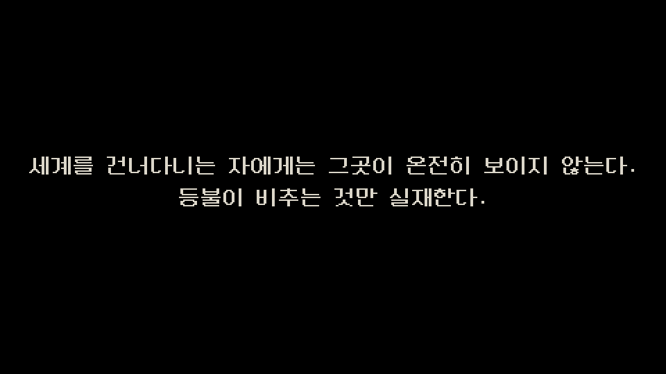

**검은 화면에 흰 글자.** 여기서 이미 화풍이 시작된다 — 픽셀 글꼴, 회색, 장식 없음.

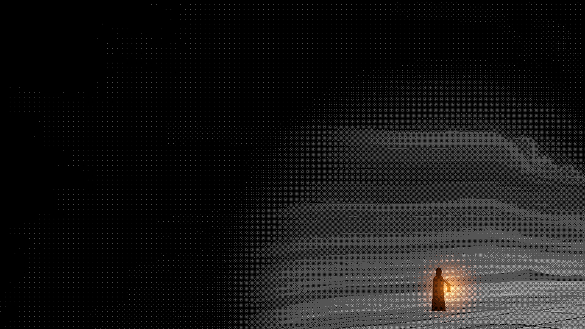

**등불이 켜지면서 세상이 보이기 시작한다.** 이 게임의 문장을 화면으로 옮긴 장면이다.

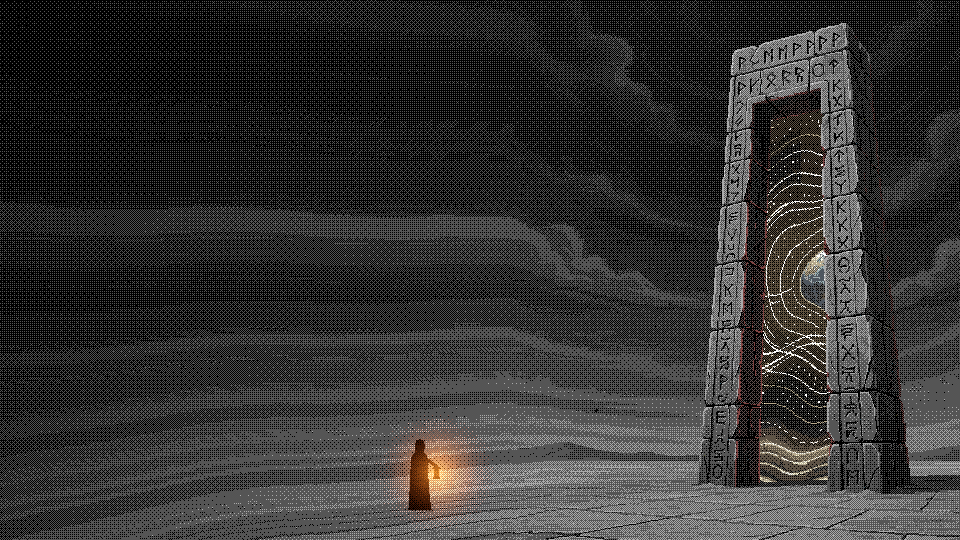

**관문.** 문 너머가 굼실거린다. 문 앞에서 위로 걸어 들어가면 서고로 넘어간다.

## 걷는다 — 서고

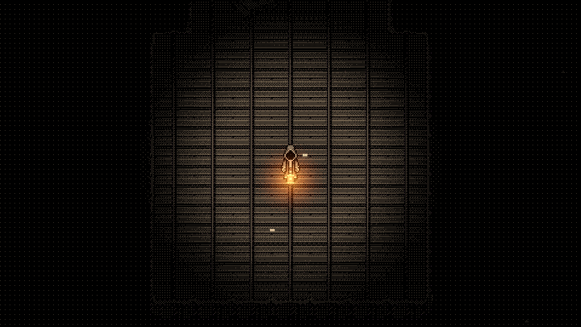

**이 사진이 실제 플레이 시야다.** 등불 반경 밖은 거의 안 보인다.
위아래좌우로 걷고, 벽은 없다 — 바닥이 끝나면 그냥 끝난다.

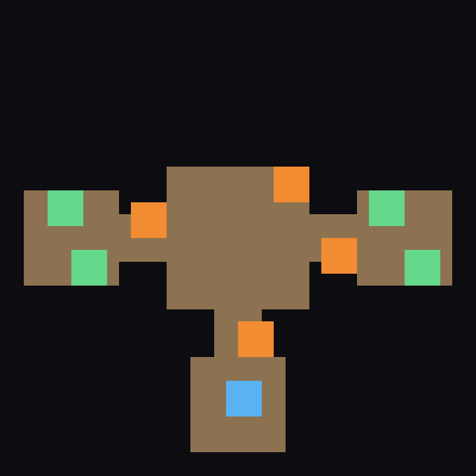

위에서 내려다본 구조. **게임에서는 절대 이렇게 안 보인다.**
가운데 홀에서 네 방향으로 뻗고, 끝마다 열람실이 있다.

## 읽는다 — 해독 두 단계

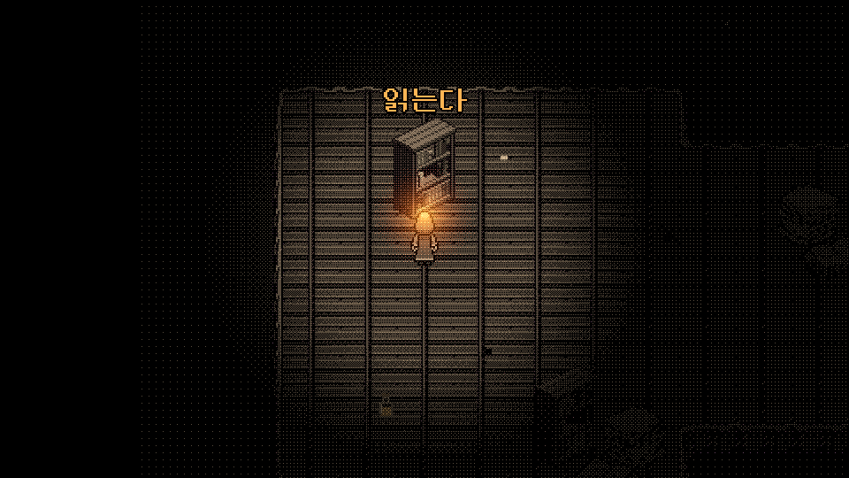

서가에 다가가면 **"읽는다"** 가 뜬다. 넷을 다 읽어야 북쪽 길이 열린다.

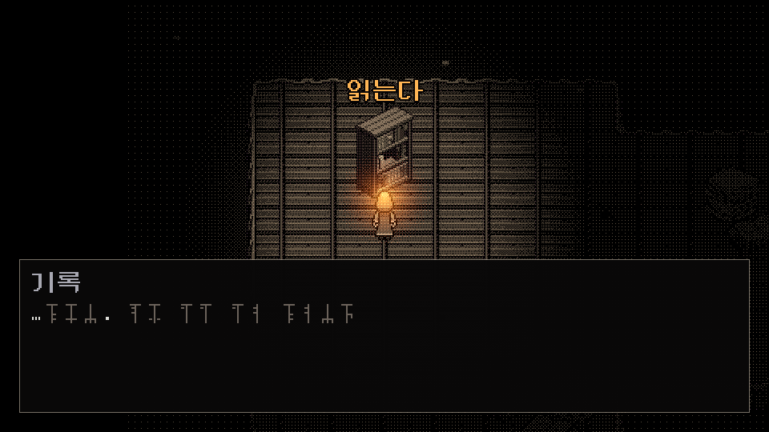

**1단계 — 우리가 모르는 문자가 한 자씩 써진다.** 아직 아무것도 안 읽힌다.
이 문자는 실제로 만든 것이다(24자, 줄기 하나에 표식이 붙는 규칙).

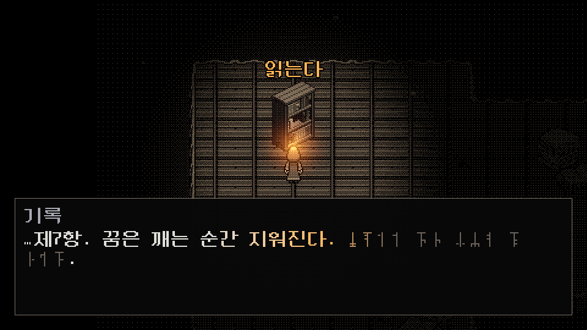

**2단계 — 등불빛이 글줄을 훑고 지나가면서 그 자리가 한글로 풀린다.**
빛이 닿는 자리의 옛 문자는 떨리고, 지나간 자리는 등불색에서 천천히 식는다.
**빛이 지나간 자리가 읽힌다** — 이 게임의 전제가 그대로 연출이 된 자리다.

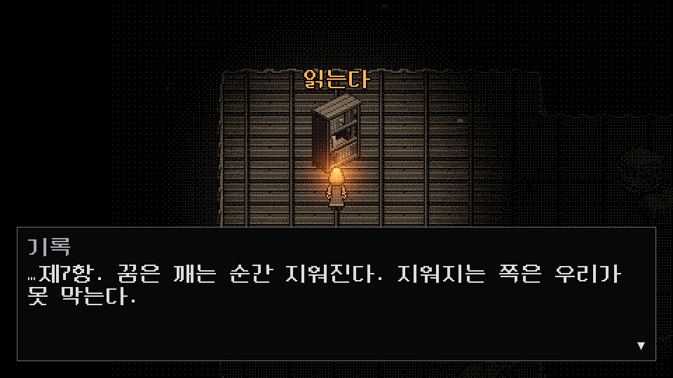

**3단계 — 다 풀린 뒤.**

## 싸운다 — 등불이 마나다

전투는 **씬을 갈아타지 않는다.** 서 있던 자리에서 카메라만 돈 것처럼 좌우로 옮겨 앉는다.

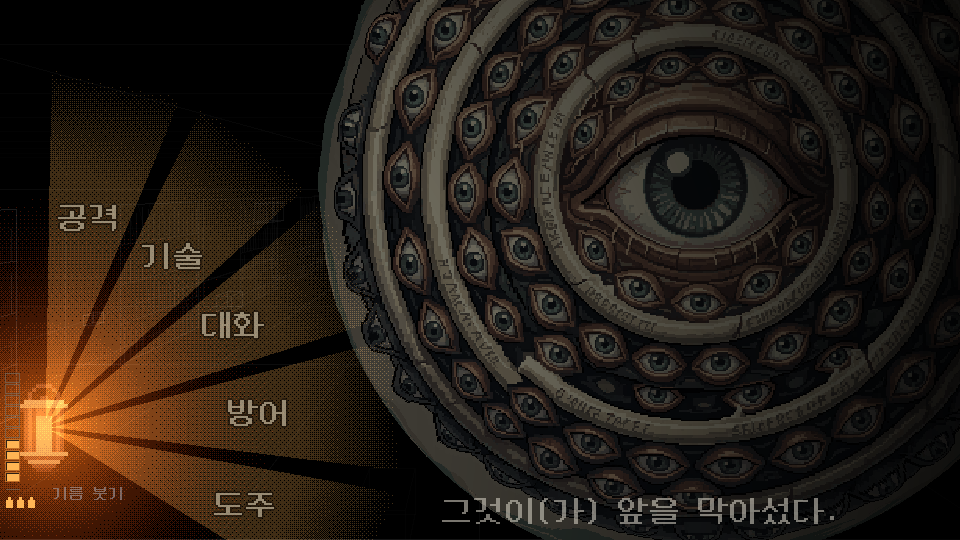

**등불에서 빛줄기가 뻗어 나오고 그것이 메뉴다.** 왼쪽 아래가 등불 게이지(눈금 열 칸)와
남은 기름병이다. **대화가 공격과 같은 층에 있다** — 이 게임에서 전투는 꼭 때리는 것이
아니다.

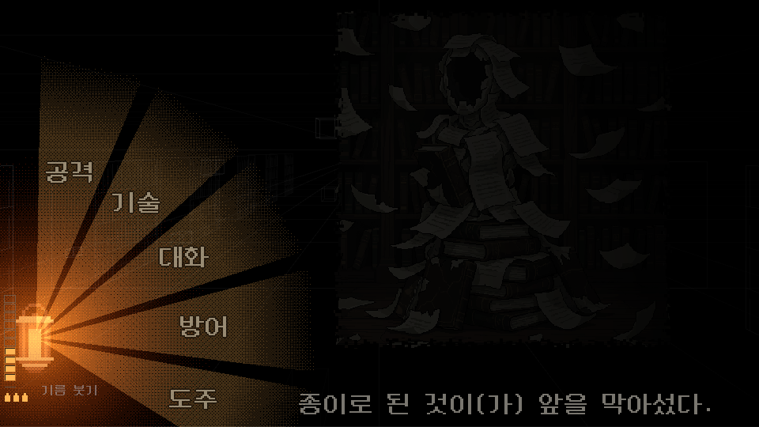

서고의 잡졸. 바닥에 널린 종이 더미 중 몇이 일어선다.

### 규칙 — 하스스톤인데 거꾸로다

체력과 밝기를 갈라 놓았다.

```
체력       0~40.  맞을 때만 준다.               0이면 패배
등불 눈금   0~10.  매 턴 이만큼 마나가 나온다
                  2턴마다 1씩 마른다.           0이면 주먹질만 된다 (패배는 아니다)
```

| 쓰는 것 | 값 |
|---|---|
| 공격 | 마나 2 · 피해 6~10 |
| 주먹질 (마나가 모자랄 때) | 마나 0 · 피해 2~4 |
| 방어 | 마나 1 |
| 대화 | **공짜** |
| 기름 붓기 | 병 하나 → 눈금 +2 (시작 3병) |

**크리스탈이 늘어나는 게 아니라 줄어든다.** 기름을 붓는 턴은 지금은 손해고 다음 턴부터
이득이라, 램프를 할지 지금 때릴지가 매 턴 판단이 된다. 그리고 **전투가 길어지면 반드시
진다** — 따로 타이머를 안 건다.

## 등불이 곧 화면 밝기다

눈금이 그대로 화면 밝기다. **UI를 하나 더 안 그린다.**

| 환함 | 은은함 | 불씨 |
|---|---|---|
| 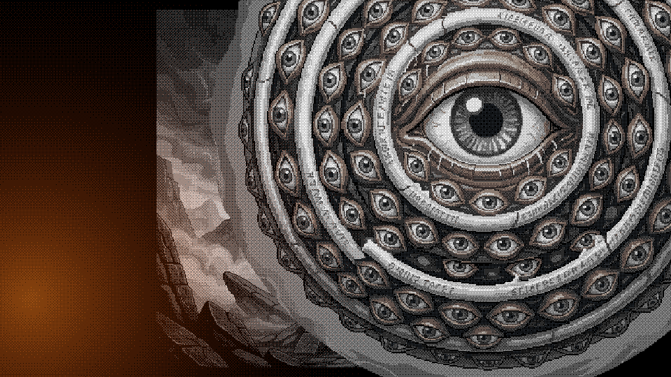 | 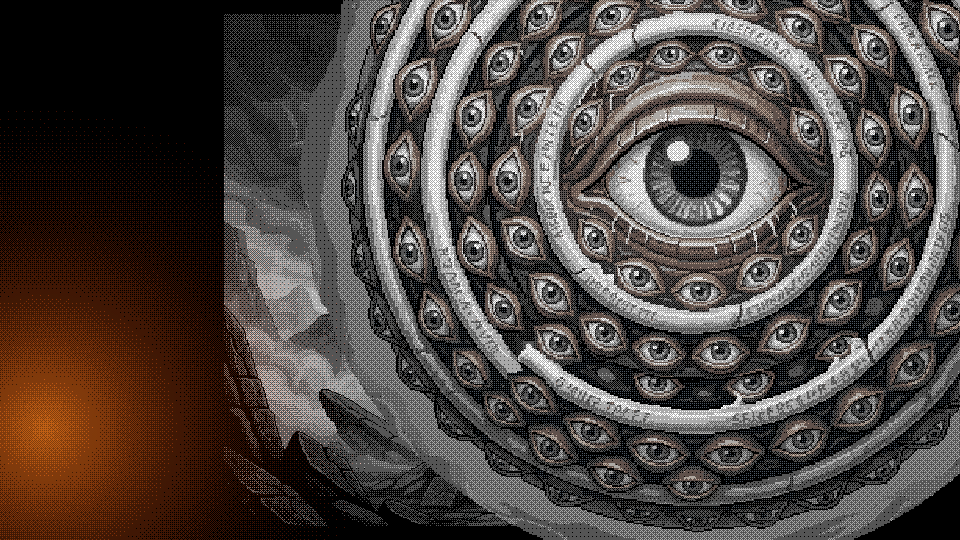 | 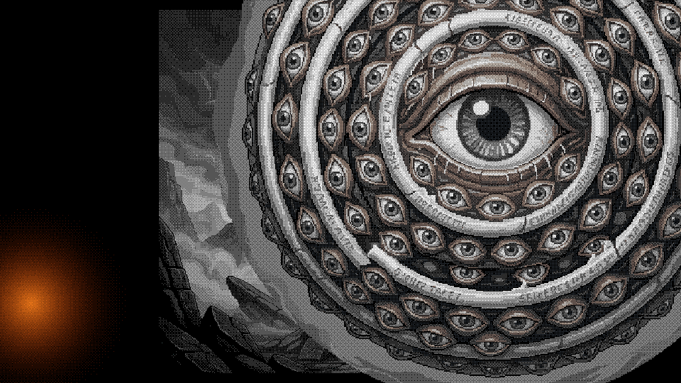 |

여섯 단계다 — **환함 · 밝음 · 은은함 · 어스름 · 불씨 · 꺼짐.**
어두워질수록 **화면에서 색이 빠지고**, 대신 **도망치기는 쉬워진다.**

**그림을 그릴 때 이걸 꼭 염두에 둬야 한다** — 같은 그림이 여섯 단계의 밝기로 보인다.
제일 어두운 단계에서도 실루엣이 읽혀야 하고, 제일 밝은 단계에서도 안 뭉개져야 한다.

---
---

# 부록 — 그리는 규칙

## ★ 규칙 1 — 놓일 크기 그대로 그린다

**이것 하나가 제일 중요하다.**

```
게임 내부 해상도는 960x540이고, 화면 전체를 정수배로만 확대한다 (1080p = x2, 4K = x4).
그래서 놓일 크기 그대로 그리면 도트 하나가 화면 픽셀 정수 개에 딱 떨어져 절대 안 뭉개진다.
```

- **크게 그려서 줄여 넣지 않는다.** 작게 그려서 늘려 넣지도 않는다
- 크기가 안 맞으면 **확대/축소 대신 투명 여백을 자르거나 덧붙여서** 맞춘다
- 픽셀 글꼴도 같은 이유로 **네이티브 크기(16px)의 정수배로만** 쓴다

이 규칙을 어기면 손으로 찍은 도트와 격자가 어긋나서, 화면 안에서 그 그림만 흐릿하게 뜬다.

## 규칙 2 — 화면 전체에 디더 필터가 걸린다

화면이 통째로 **4단계로 양자화**되어 도트 격자로 흩어진다. 그래서:

- **어두운 바닥에 어두운 자국을 찍으면 사라진다.** 같은 단계로 뭉개져서 바닥과 하나가 된다.
  어두운 데서 보여야 하는 것은 **밝게** 그린다 *(실제로 겪었다 — 바닥 자국이 통째로 안 보였다)*
- **미묘한 그라데이션은 안 살아남는다.** 단계가 넷뿐이다
- 반투명한 판은 뒤의 격자가 비쳐서 지저분해진다

## 규칙 3 — 색을 아껴 쓴다

필터가 채도 낮은 것을 걷어내고 **쨍한 것만 남긴다.** 색을 쓰면 그 자리가 튄다 —
그것을 의도할 때만 쓴다.

```
등불색          #ffb454     주인공이 든 등불. 화면에서 제일 또렷한 것이고 다른 데 쓰면 안 된다
못 읽는 글자     #6b625a
```

바탕 팔레트(많이 쓰인 순서, `assets/palette.txt`):

```
#15141a  #4e3c33  #4a3932  #0c070b  #57463b  #715e4a  #0d0709  #c2ad89
#0d070e  #11090e  #332524  #7a664e  #140c0d  #040303  #76624c  #43332b
```

**갈색과 검정이 거의 전부다.** 파란기(`#4d5261`, `#7a8293`)는 아주 조금 섞여 있다.

## 규칙 4 — 광원은 등불 하나다

세상은 기본적으로 안 보인다. **등불이 뚫은 원 안**만 보이고 그 밖은 아주 흐릿한 잔광뿐이다.
그림에 자체 발광을 넣으면 이 규칙이 깨진다 — **빛나야 하는 것만 빛난다.**
스테인드글라스나 균열처럼 의도적으로 색이 남는 것은 예외로 둔다.

## 규칙 5 — 실루엣이 전부다

어둡고 회색이고 필터가 걸리므로 **디테일은 거의 안 보인다.** 형태로 구별되게 그린다.

---

## 지금 있는 것 (규격)

| 무엇 | 파일 | 크기 |
|---|---|---|
| 주인공(순례자) 4방향 | `assets/characters/pilgrim/*.png` | **48x48** |
| 주인공 — 관문 장면용 | `assets/photos/pilgrim.png` | 44x80 |
| 등불(손에 든 것) | `assets/characters/pilgrim/lantern.png` | 8x11 |
| **그것** — 서고의 눈 고리 | `assets/enemies/watcher.png` | **656x656** |
| 종이 더미(잡졸) | `assets/enemies/paper_pile.png` | 64x64 |
| 텅 빈 갑옷 | `assets/enemies/hollow_armour.png` | 160x208 |
| 책장 | `assets/tilesets/bookshelf.png` | 37x58 |
| 바닥 타일 | `assets/tilesets/*_image.png` | 128x128 |
| 관문 그림 | `assets/photos/gate_4_wide.png` | 1260x584 |
| 못 읽는 문자 24자 | `assets/ui/glyphs/*.png` | 12x16 |

**서고 타일 한 칸은 32px**이고 카메라 배율이 2라 **화면에서는 64px**로 보인다.
그래서 서고 안에 놓을 물건은 **32의 배수**로 생각하면 편하다.

**`assets/photos/`의 그림들은 참고 자료가 아니라 실제로 쓰고 있는 것**이다(관문 배경,
문 너머, 주인공 서 있는 모습). PixelLab으로 뽑은 것이다.

## 그려야 할 것 ***(미정 — 목록과 우선순위는 상의해서 정하면 된다)***

### 급한 것 — 첫째 꿈

| 무엇 | 왜 필요한가 | 크기 |
|---|---|---|
| **그것** — 세계를 도는 거대한 생물 | 첫째 꿈의 중심. 지평선에 늘 보인다 | 화면 절반 이상 |
| **그늘** — 그것이 드리우는 유일한 밤 | 이 세계의 유일한 안전지대 | 배경 |
| 사막 바닥 타일 | 뜨겁고 밝고 평평하다 | 32x32 |
| **행렬** — 그늘을 따라 걷는 사람들 | 처음 만나는 것. 얼굴은 안 그린다 | 48x48 |
| **마을** | 따라가기를 그만둔 사람들 | 타일 + 소품 |
| **노인** | 의문의 최초. 괴물이 된다 | 48x48 + 괴물 형태 |
| 부스러기 적들 | 첫째 꿈의 잡졸 | 64x64 안팎 |

### 그다음 — 서고를 채운다

지금 서고는 **읽는 서가 4 · 종이 더미 4 · 기름병 3 · 떠다니는 책 3 · 바닥 금 6**이 전부라
**복도가 텅 비어 있다.** 심연 위에 떠 있는 방이라는 그림을 살릴 소품이 더 필요하다.

### 나중 — 계단의 방, 둘째·셋째 꿈

배(검고 차갑고 좁다)와 왕의 계곡(거대한 것들 아래를 걷는다)이 큰 덩어리다.
세부는 `둘째꿈.md` · `셋째꿈.md`에 다 적혀 있다.

## 아직 안 정해진 것

**그림에 영향을 주는 것들이라 먼저 알고 있어야 한다.**

- **이름이 하나도 없다** — 세계도, 그것도, 노인도, 박사도, 아이도, 배도
- **주인공의 얼굴** — 지금은 후드를 쓴 실루엣이다. 얼굴을 그릴지 안 그릴지 안 정했다
- **넷째 꿈** — 코즈믹 호러 쪽으로 가기로만 했다
- **계단의 방** — 꿈으로 가는 중간 거점
- **배신자를 언제 어떻게 만나는가**

---

*화면 사진은 `Godot --path . --audio-driver Dummy res://tools/_shots.tscn -- --walk`와
각 씬의 `--capture` / `--shot` 플래그로 다시 찍을 수 있다. 화면이 바뀌면 다시 돌리면 된다.*
